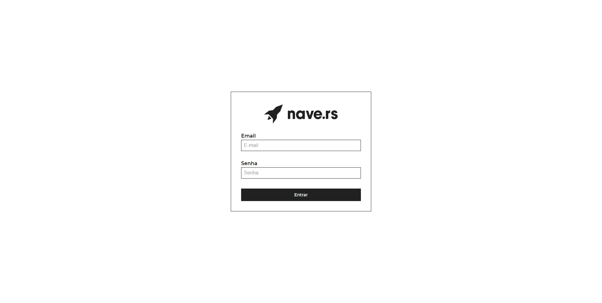
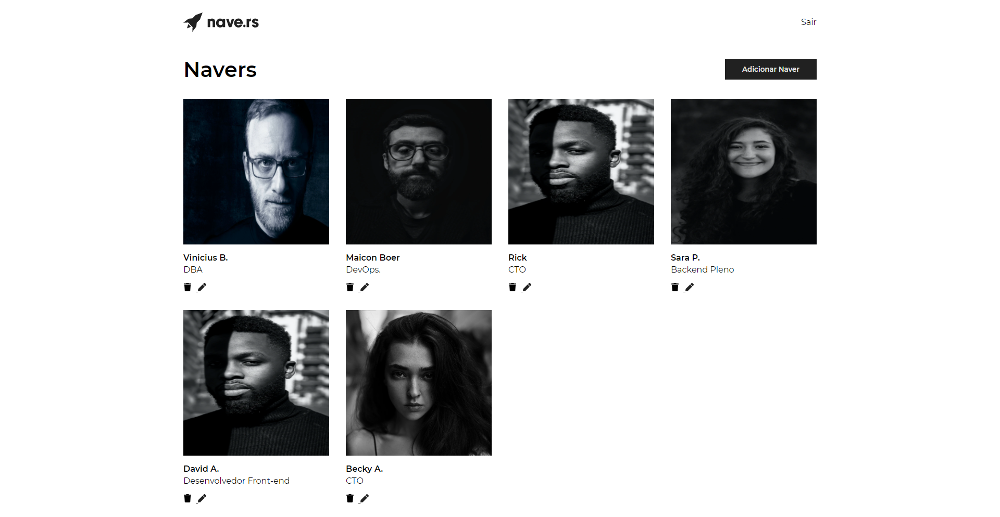
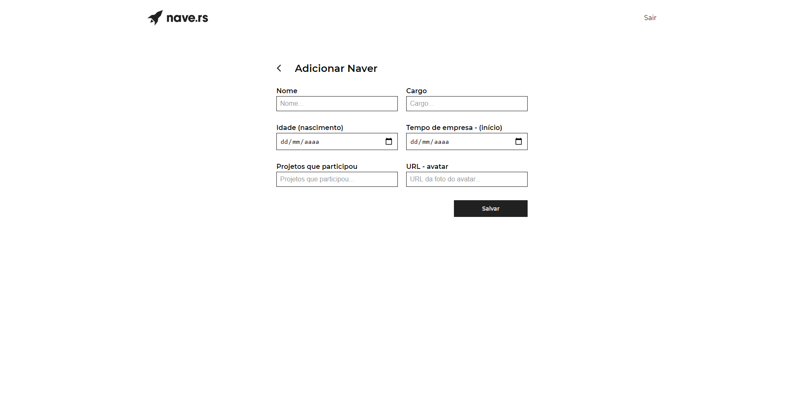
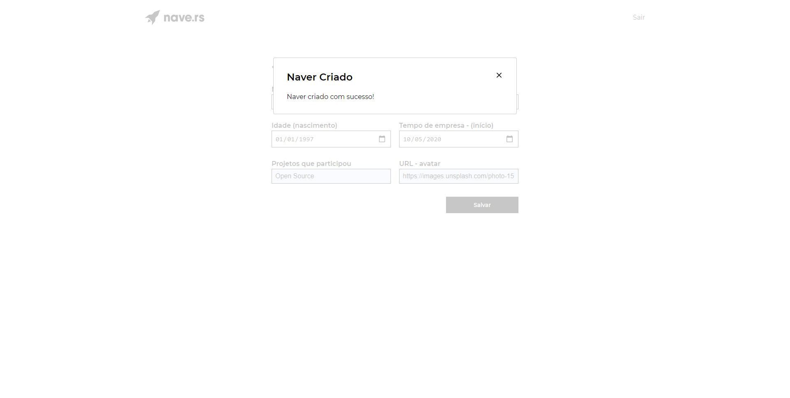
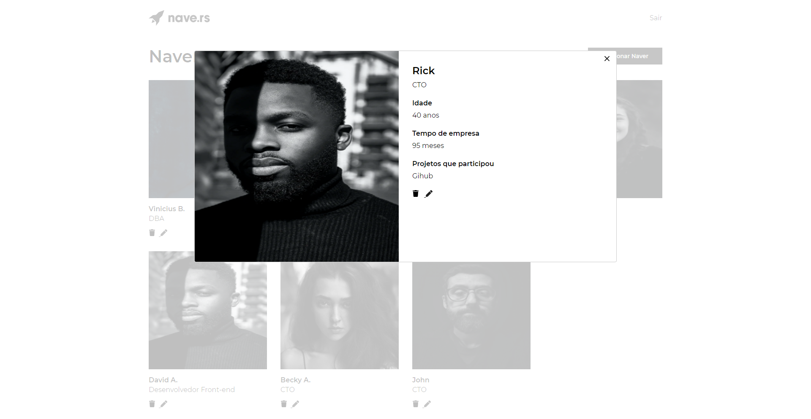
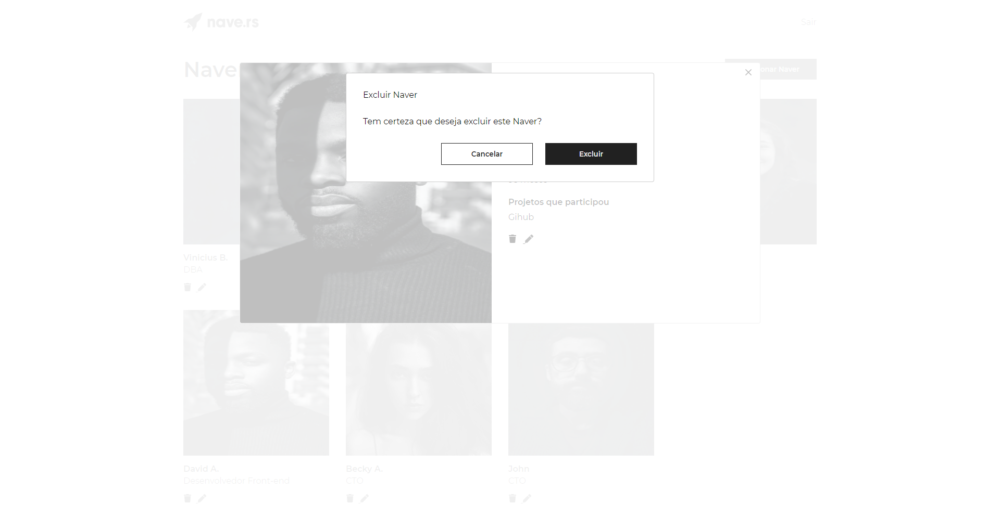
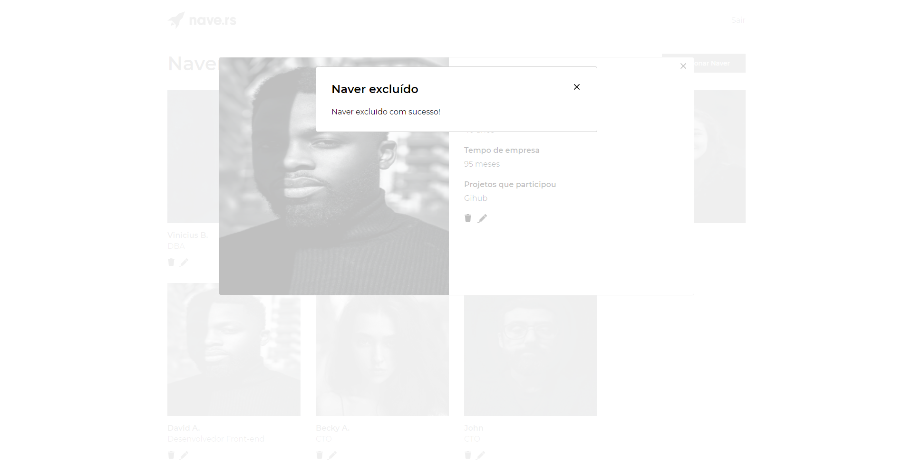
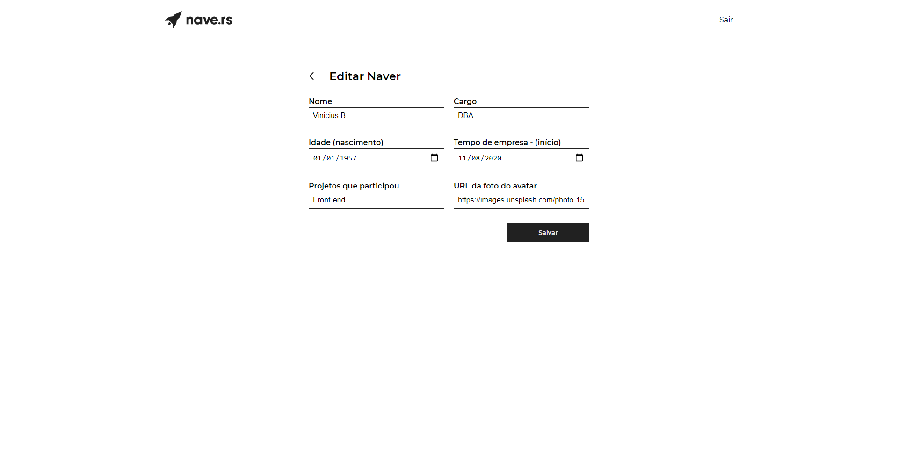
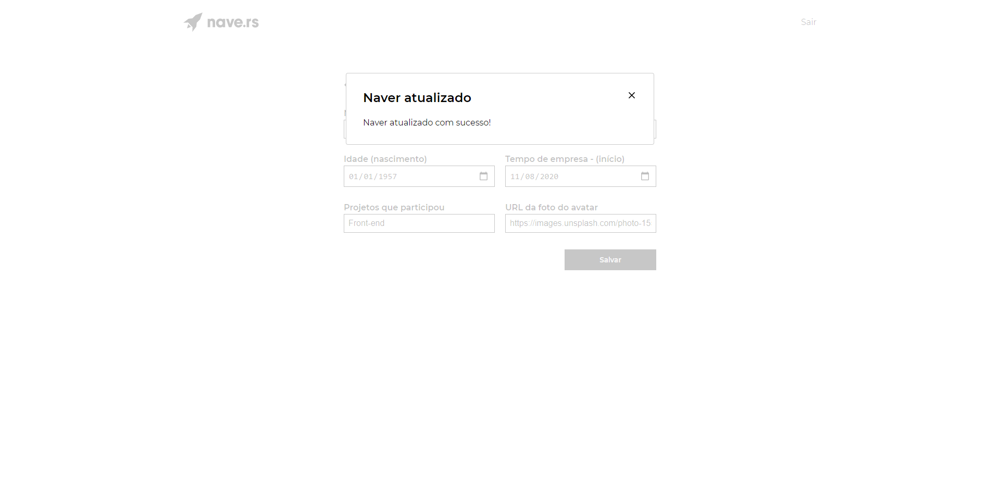

# Navedex 🚀

### Web app para visualização e criação dos navers, possuindo informações como:   
Nomes, idades, cargos, tempo de empresa e projetos que participou.

------------------------------------------------------------

<p align="center">
   
   
    
</p>

<p align="center">
   
   
    
</p>

<p align="center">
   
   
    
</p>

<p align="center">	
   <a href="https://www.linkedin.com/in/maicon-boer-35210797/">
      
   </a>

  
  <a href="https://github.com/maiconboer/navedex/stargazers">
    
  </a>
</p>


# Especificações

* [Tecnologias](#computer-tecnologias)
* [Funcionalidades](#rocket-funcionalidades)
* [Como rodar](#construction_worker-como-rodar)

# :computer: Tecnologias
Utiliza as seguintes tecnologias:

**Front-end: Web**
<ul>
  <li>ReactJS</li>
  <li>Styled-Components</li>
  <li>Axios</li>
</ul>

**Back-end**
<ul>
  <li>API fornecida pela Nave.rs</li>
</ul>

# :rocket: Funcionalidades

### Login
A web app deverá possui um fluxo de autenticação, onde o usuário só pode acessar as telas internas do sistema (listagem, formulários) passando pela tela de login com as credenciais criadas previamente.

### Listagem
A página inicial da aplicação (home) lista os navers cadastrados.

### Visualização
Ao clicar em algum naver da listagem, o usuário tem uma visualização completa das informações do mesmo.

### Criação/edição
O usuário criar um novo naver ou editar um já existente.

### Detalhes   

O title de cada página muda de acordo com as rotas.

Possui validação de e-mail no login.
No cadastro Naver, possui validação em 3 campos:

- ```name``` (Necessário ao menos 3 caracteres).
- ```job_role``` (Necessário ao menos 3 caracteres).  
- ```url``` (Necessário ao menos 5 caracteres).

**Se estes campos não possuirem estas quantidades mínimas de caracteres, não realiza o post, retorna erro.**  

# :construction_worker: Como rodar
```bash
# Clone o Repositorio
$ git clone https://github.com/maiconboer/navedex.git
```
### 🚀 Rode a aplicação

```bash
# Acesse a pasta principal do projeto (navedex).
$ cd navedex
# Instale as depedencias
$ yarn install
# Inicie a aplicação
$ yarn start
```
Aplicação rodando no endereço: http://localhost:3000

**Para efetuar login, é necessário criar o usuário, fazendo um post na rota ```{{apiUrl}}/users/signup``` enviando e-mail e senha no corpo da requisição.**


